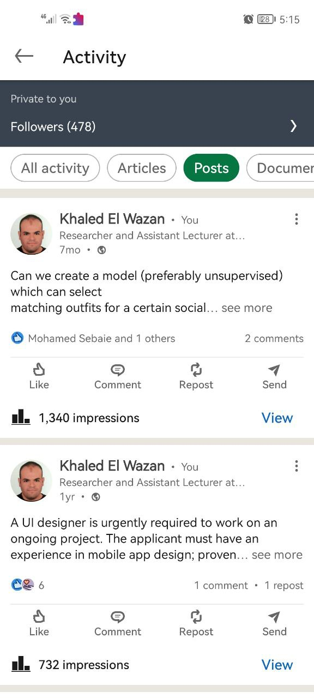

# Android LinkedIn Posts Activity Clone
This is a clone of LinkedIn Posts Activity. It is a simple app that shows a list of posts and their details. 

## Features
- List of posts and their details

## Dependencies
* [Butterknife](https://github.com/JakeWharton/butterknife) - Field and method binding for Android views
* [Glide](https://github.com/bumptech/glide) - Image loading and caching library for Android

## Screenshots

## Installation

To install and run the app, follow these steps:

1. Clone the repository: `git clone https://github.com/KhaledElwazan/linkedin-posts-activity-clone.git`
2. Open the project in Android Studio
3. Build and run the app on your device or emulator

## Contributing

Contributions are always welcome! If you have any suggestions or find any bugs, please open an issue or submit a pull request.

## License

This project is licensed under the MIT License - see the [LICENSE](/LICENSE) file for details.